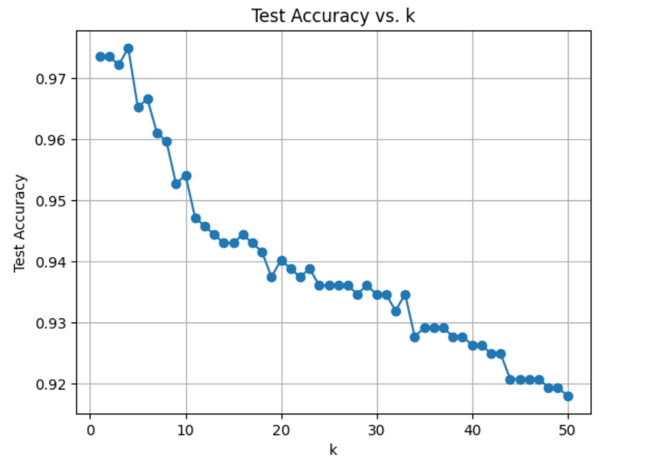

# K-Nearest Neighbors (KNN) Classifier Implementation (From Scratch)

## Overview

This project implements a K-Nearest Neighbors (KNN) classifier from scratch in Python without using any machine learning libraries like scikit-learn. The classifier is trained on a tabular dataset to predict the class of unseen data points based on their nearest neighbors in the feature space. The project also includes a method to plot how the test accuracy changes with different values of k.

## Files

- knn.py: This is the main script that contains the MyKNN class, methods for training, prediction, and visualization of test accuracy for varying values of k.

## Key Features

### 1. KNN Classifier:
- **MyKNN(k=3):** Initializes the classifier with a specified value of k (number of nearest neighbors).
- **fit(X_train, y_train):** Stores the training data X_train and y_train for later prediction.
- **predict(X_test):** Predicts the labels for the test data X_test by calculating the distance of each test point from all training points and selecting the most frequent label among the k nearest neighbors.
- **make_prediction(x):** Helper function to make a prediction for a single test point by calculating its distance to each training point and finding the majority class among the nearest neighbors.

### 2. Custom Distance Calculation:

- **calculate_distance(point1, point2):** This function computes the Euclidean distance between two data points.

### 3. Accuracy Calculation:

- Accuracy is calculated by comparing predicted labels with the actual labels and dividing the number of correct predictions by the total number of predictions.

### 4. Plot Accuracy vs. k:

- The implementation includes functionality to evaluate the model's performance for different values of k (from 1 to 50), allowing for hyperparameter tuning. The results are plotted to show the relationship between k and test accuracy.



## Dataset

The model uses a CSV dataset (Data.csv) where the target column is Genus. The dataset is preprocessed using LabelEncoder to transform categorical features into numeric form, and columns Family and Species are dropped from the features.

The dataset is split into training and test sets:

- 30% of the data is used for training
- 10% of the data is used for testing

## Usage

### 1. Install dependencies:

``` pip install numpy pandas matplotlib ```

### 2. Running the Model:

- Place the dataset Q1Data.csv in the same directory.
- Run the script:

``` python3 knn.py ```

### 3. Output:

- The script will train the KNN classifier on the training data and predict the labels for the test data.
- It will print the accuracy of the classifier and display a plot showing the accuracy for different values of k.